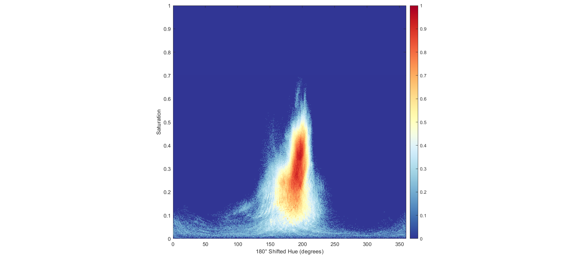

# Face Detection and Recognition

Face detection and recognition program developed in Matlab for the course [Advanced Image Processing (TNM034)](https://liu.se/studieinfo/kurs/tnm034) at Linköpings Universitet. Both Eigenfaces and Fisherfaces recognition models are implemented. The program uses the [Caltech Faces 1999](http://www.vision.caltech.edu/html-files/archive.html) dataset which contains 450 images of 27 people with various facial expressions, taken in different environments and under various lighting conditions.

The models are trained with 72 images of 16 people that have been assigned different ID-numbers. The remaining people are unknown, and the program should recognize them as such and return an ID of 0. The number of training images is limited to 72 to leave a sufficient amount of images to test the program with. The test images have never been seen by the program prior to testing and no weight information about them are stored.

## Accuracy

Of the remaining 378 images that the program hasn't seen before, the program is able to correctly detect and recognize 98.68% of the faces using the fisherfaces model, either with the ID corresponding to the person or 0 if the person is unknown. This could be increased to about 99.2% with more training images, but no more since the detection fails in three extremely underexposed images. The eigenfaces model only correctly recognizes 91.53% of the faces, despite using more principal components than the fisherfaces model.

| Model       | Accuracy | FRR   | FAR   |
| ----------- | -------- | ----- | ----- |
| Fisherfaces | 98.68%   | 1.32% | 0.00% |
| Eigenfaces  | 91.53%   | 7.67% | 0.79% |

The training images are not included in these numbers as these are guaranteed to be recognized correctly. False rejection rate (FRR) refers occurrences where the program doesn't recognize a known face, while false acceptance rate (FAR) refers to occurrences where the program thinks that it recognizes face that in reality is either unknown or belongs to a different known person. Both of the models have distance thresholds set to optimally reduce the sum of false acceptance and rejection rates.

## Report

A report describing this work in more detail is available [here](report.pdf). It was written in a short time and the structure and formulations are often lacking because of it, but it may still be informative. Much of the code contains more implementation-specific commented explanations.

## Requirements

The following products are required to run the program:

| Name                                    | Version      |
| --------------------------------------- | ------------ |
| Matlab                                  | R2019b (9.7) |
| Image Processing Toolbox                | 11.0         |
| Statistics and Machine Learning Toolbox | 11.6         |

## Visualizations

The following are a few visualizations of parts of the detection and recognition pipeline created for the report.

___

<h5 align="center">Skin Model</h5>

___

<h5 align="center">Evaluation and Otsu Thresholding</h5>

___

<h5 align="center">Face Mask Detection</h5>

___

<h5 align="center">Face Triangle Detection and Normalization</h5>

___

<h5 align="center">Recognition Model</h5>

